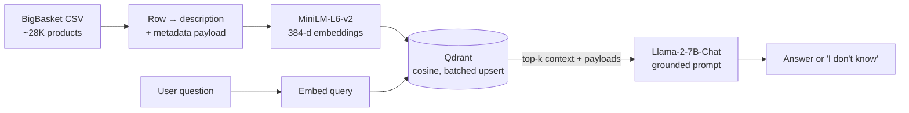

# 🔎 Context-QnA

> A grounded retrieval-augmented (RAG) question-answering bot over a 28K-product grocery catalog — answers strictly from retrieved context, and says "I don't know" rather than hallucinate.

<p>
  
  
  
  
  
</p>

---

## Overview

Context-QnA is an end-to-end **RAG pipeline** built over the [BigBasket](https://www.kaggle.com/datasets/surajjha101/bigbasket-entire-product-list-28k-datapoints) grocery catalog (~28K products). It turns each product row into a natural-language description, embeds and indexes everything in a vector store, and answers free-text questions ("*what is the price of chia seeds?*") by retrieving the most relevant products and letting a local Llama-2 model answer **only** from that retrieved context.

The design goal is **faithfulness**: the prompt explicitly instructs the model to refuse rather than invent answers when the context doesn't contain them.

## Features

- **Structured → text ingestion** — each product becomes a descriptive sentence plus a structured metadata payload (name, category, brand, price, rating, …).
- **Semantic retrieval** — `all-MiniLM-L6-v2` sentence embeddings (384-dim) indexed in **Qdrant** with **cosine** similarity.
- **Batched indexing** — vectors are upserted in batches of 512 with a post-hoc count assertion to verify the full catalog is indexed.
- **Grounded generation** — **Llama-2-7B-Chat (GGML)** runs locally via `CTransformers` with an anti-hallucination prompt.
- **Two retrieval paths** — a hand-rolled `client.search` + `LLMChain` path, and a LangChain `RetrievalQA` (`stuff`, top-k = 2) chain.
- **Multi-turn chat loop** — a simple `ConversationManager` accumulates context for an interactive REPL.

## How it works



## Tech stack

| Stage | Tool |
|---|---|
| Embeddings | `sentence-transformers/all-MiniLM-L6-v2` (384-d) |
| Vector store | Qdrant (in-memory), cosine distance |
| LLM | Llama-2-7B-Chat GGML via CTransformers (temp 0.2) |
| Orchestration | LangChain (`RetrievalQA`, `LLMChain`, `PromptTemplate`) |
| Data | pandas, BigBasket 28K-product catalog |

## Getting started

The project is written as a Colab-style notebook (`QnA.ipynb`) using `/content/` paths — easiest to run on **Google Colab** (free GPU optional; the pipeline also runs CPU-only).

```bash
# Dependencies (also installed in the notebook's first cell)
pip install datasets==2.12.0 qdrant-client==1.2.0 sentence-transformers==2.2.2 \
            torch==2.0.1 langchain ctransformers
```

1. Open `QnA.ipynb` (locally with Jupyter, or upload to Colab).
2. Place `bigBasketProducts.csv` where the notebook expects it (`/content/` on Colab).
3. Run the cells top to bottom — they build descriptions, embed and index into Qdrant, then load Llama-2.

## Usage

```python
# One-shot retrieval + answer
getInfo("what is the price of chia seeds?", top_k=1)

# Or the LangChain RetrievalQA path
qa_bot_qdrant_response("which organic products are under 200 rupees?")

# Or interactive chat
# >>> run the ConversationManager loop and type questions; 'exit' to quit
```

## Notes & limitations

- Uses an **in-memory** Qdrant instance (`:memory:`) — the index rebuilds on every run. Point the client at a persistent/hosted Qdrant for reuse.
- Llama-2-7B-Chat GGML is CPU-friendly but modest; answer quality scales with a larger or GPU-served model.
- Domain is the grocery catalog; retrieval prompts are tuned for product Q&A.

## Future work

- Persist the Qdrant collection and add metadata **filtering** (price/category) on top of semantic search.
- Add reranking and evaluation (retrieval hit-rate, faithfulness).
- Wrap the pipeline in a FastAPI service + lightweight UI.
